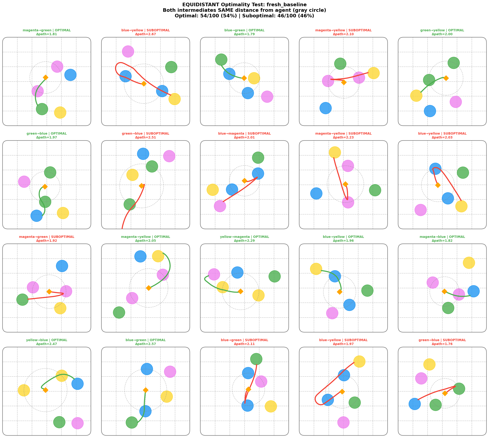
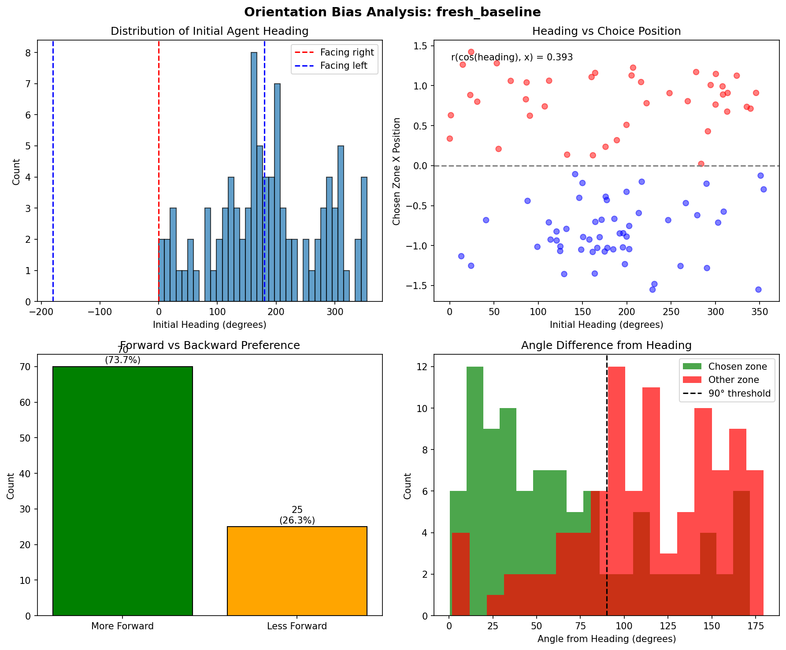
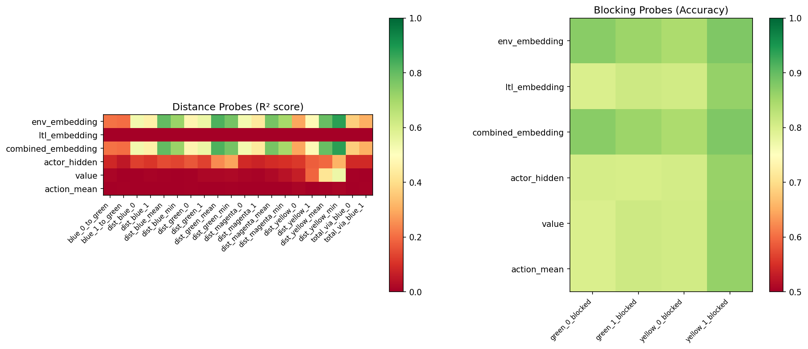
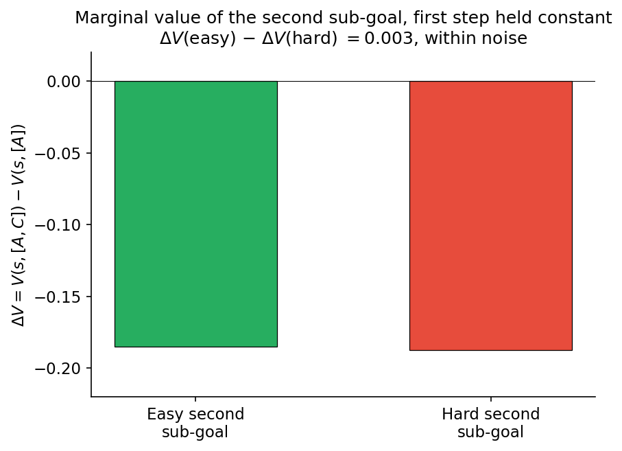
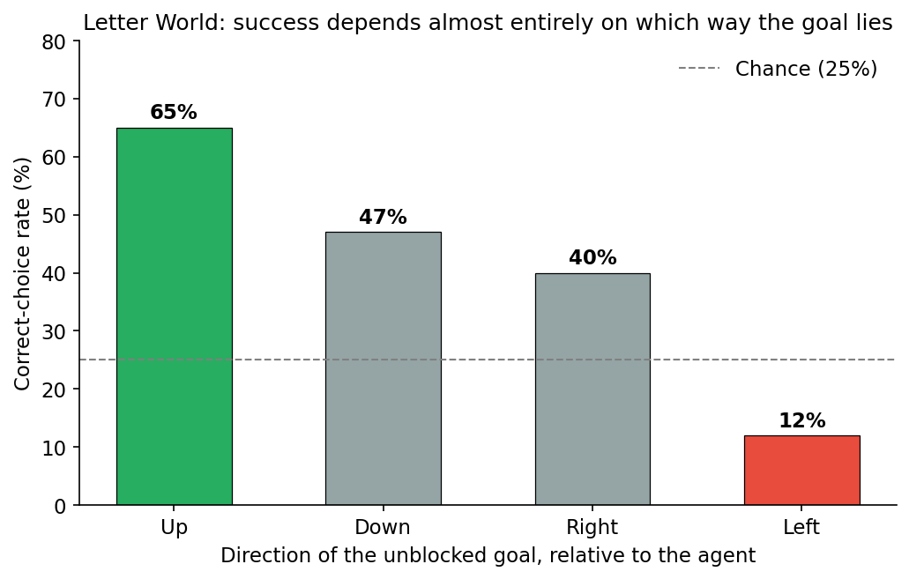

# Does DeepLTL Plan?

[DeepLTL](https://openreview.net/forum?id=9pW2J49flQ) (Jackermeier & Abate, ICLR 2025) is a goal-conditioned reinforcement-learning agent that satisfies Linear Temporal Logic tasks with approximately 95% success on the paper's benchmark suite. Its Figure 1 is a particularly suggestive demonstration: given the task `F blue THEN F green` and two candidate blue zones, the agent selects the blue zone that is *farther from its current position* because doing so leaves a shorter onward path to green. If the agent makes this choice systematically, it is performing multi-step planning.

This post reports an investigation into whether it does.

**Summary.**
- Linear probes recover sub-goal and spatial information from the agent's hidden states at 94–99% accuracy. The representation is *egocentric* — directions relative to the agent rather than world coordinates — and activation-level steering interventions change behaviour only in about 1% of attempts.
- On a custom environment in which the myopic and optimal sub-goals disagree by construction, the agent chooses optimally approximately **50%** of the time, indistinguishable from chance. Equating the distances from the agent to the two candidates (so that the "closer zone" heuristic cannot discriminate) yields 54%.
- The residual above-chance signal is attributable to an **orientation bias**: the agent moves in its initial heading direction 74% of the time (p < 0.0001). With orientation controlled, optimality falls to 58%, 95% CI [48%, 68%], p = 0.125.
- Consistent with the behavioural picture, probes decode the agent's own distance to each zone (R² 0.74–0.93) but not the *chained* distance from the intermediate zone to the goal (R² 0.08–0.18). The value function is first-step dominated: `ΔV(easy) − ΔV(hard) = 0.003`, within noise.
- A sweep of training interventions intended to induce planning — a chained-distance auxiliary loss, a transition-prediction loss, a lower discount factor, and a two-step-heavy curriculum — did not shift the optimality rate. The best of the curriculum/discount variants achieves 85% task success with 52% optimal choice (p = 0.76).

Taken together, the evidence suggests that DeepLTL's 95% success rate is produced by a compact stack of reactive heuristics — forward motion, closest relevant zone, reactive obstacle avoidance — rather than by planning. This is consistent with the paper's reported task performance while narrowing the mechanistic interpretation of its planning claim.

This is joint work with Jonathan Richens (Google DeepMind); the framing draws on [*General Agents Need World Models*](https://arxiv.org/abs/2506.01622). Mathias Jackermeier, the DeepLTL author, was generous with his time, and several of the training interventions described below were his suggestions.

---

## Background

DeepLTL's architecture has three components. An **LTL encoder** compiles the task formula — `F blue ∧ G ¬yellow`, for instance ("eventually reach blue, always avoid yellow") — into a sequence of sub-goals via a deterministic-Büchi automaton, summarised by a GRU. An **environment encoder** is an MLP over lidar observations. A **policy head** concatenates the two and outputs continuous actions for a point robot in the "Zone" environment, a flat arena populated with coloured circular zones that the agent must visit or avoid in some specified order.

The planning claim is most cleanly tested on `F blue THEN F green` with two candidate blue zones. A planning agent should prefer the blue zone that leaves less distance to green; a reactive agent should prefer the blue zone that is closer to it now. The paper's Figure 1 displays the former choice. The agent also reaches 91–95% success across the paper's benchmark, which is not contested here. The question is not whether the agent completes its tasks, but how.

---

## What the network encodes

The first question is what information the network carries while solving these tasks. I trained linear probes on each module's hidden activations to predict the current sub-goal. The probes achieve 99.5% accuracy on the policy MLP, 98.1% on the environment encoder, and 94.0% on the LTL GRU hidden state. Whatever the agent is computing, the goal is highly decodable from within.

When the probe target is instead *zone positions*, a notable discrepancy appears. The probe's predicted positions drift as the agent moves — over a rollout, by approximately 158 units in a world that is only tens of units across. The cosine similarity between the agent's velocity and the direction to the nearest predicted zone is 0.927. The probe is therefore not decoding absolute positions in world coordinates; it is decoding headings relative to the agent. The internal representation is egocentric — a compass — rather than allocentric — a map.

One might expect that highly decodable goal information would also be steerable: add the probe's weight vector to the hidden state and observe the agent switching goals. Across approximately 250 interventions per module, this is mostly not the case:

| Module | Goal changes | Rate |
|---|---|---|
| LTL module | 2 / 247 | 0.8% |
| Environment encoder | 3 / 248 | 1.2% |
| Policy MLP | 3 / 252 | 1.2% |

The representation is distributed across the three modules in a manner that is robust to perturbation within any one of them. The intervention that does reliably redirect behaviour is swapping the *sequence encoder's output* wholesale — substituting one formula's encoded output for another's at the module boundary. This succeeds because it replaces the content of a bottleneck rather than nudging the content of a distributed representation. The broader point is one worth stating plainly: a successful linear probe establishes that a quantity is *present* in a representation, not that it is the handle the network uses to act.

The information, then, is in the network — in distributed and self-centric form. That state of affairs is consistent with planning and consistent with reactive heuristics. Disambiguating the two requires behavioural tests in which the two hypotheses make different predictions.

---

## A test where myopic and optimal disagree

To separate planning from reactive behaviour, the task must be one in which the nearest sub-goal and the best sub-goal diverge. I constructed such a task: `PointLtl2-v0.optvar` contains two intermediate zones of colour A and one goal zone of colour B, with layouts generated so that the intermediate zone closest to the agent is the one farthest from the goal. A reactive "pick the closest A" policy selects incorrectly; a policy that considers the full path selects correctly.

Across 100 varied layouts:

| Model | Optimal | Task success |
|---|---|---|
| `fresh_baseline` (retrained paper setup) | ~50% | 93% |
| `combined_aux02_trans01` (auxiliary-loss variant) | ~49% | 75% |

This is chance-level behaviour. It is worth pausing on, given that the agent reaches the goal 93% of the time on the same layouts: high task success, random sub-goal selection.

It is reasonable to ask whether "optimal" has been defined correctly. An alternative is to label candidates by empirical difficulty rather than geometric distance: simulate each candidate 15 times and designate the candidate with the higher completion rate as "empirically easier". Under this definition, `fresh_baseline` selects the easier candidate 68% of the time and the auxiliary-loss model 76% of the time, both with confidence intervals that exclude 50%. This appears, on first inspection, to be evidence that the agent is tracking something about the full path.

The next two sections show why it is not.

### The equidistant control

If the agent were considering the full path, removing the "closer to the agent" cue should not affect its performance. In `PointLtl2-v0.opteq` the structure is identical to `optvar`, but the two A zones are placed at equal distance from the agent (tolerance 0.05). The only remaining path-level information is the onward distance from the intermediate to B.

| Model | Optimal | 95% CI |
|---|---|---|
| `fresh_baseline` | 54% | [40%, 70%] |
| `combined_aux02_trans01` | 53% | [40%, 70%] |

The 68% empirical-difficulty signal was therefore driven by a cue that correlated with full-path difficulty in the `optvar` layouts but did not itself encode it — most likely simply "closer to the agent". Once that correlation is broken, no signal remains.

### The confound is orientation, not spatial position

A separate pattern in the data initially suggested a different interpretation. `fresh_baseline` chose the `x < 0` zone 66% of the time; `combined_aux02_trans01` chose the `x > 0` zone 61% of the time. Two models with opposite left/right preferences is, in itself, weak evidence against planning, but it does not yet identify the actual rule.

Logging the agent's initial heading produced a cleaner account. Both models prefer forward motion — movement in whatever direction the agent is facing at reset. Across 95 episodes on `fresh_baseline`:

- Forward preference: **73.7%** (p < 0.0001).
- When only one candidate zone lies in the forward half-plane, the agent selects it in **79.5%** of episodes.
- The apparent left/right bias of 56.8% is fully accounted for by the joint distribution of starting heading and zone position.

I therefore repeated the optimality test with orientation controlled: at each reset, the agent's heading was set to face the midpoint between the two A zones, so that neither candidate was more "forward" than the other. Any above-chance optimality remaining under this protocol has to come from genuine path reasoning.

| Model | Optimal | 95% CI | p | Spatial balance |
|---|---|---|---|---|
| `fresh_baseline` | **58.3%** | [48.3%, 67.7%] | 0.125 | 50/50 L/R |
| `opt_d099_mixed` | 52.0% | [42.3%, 61.5%] | 0.764 | 50/50 L/R |

Both confidence intervals contain 50%. The left/right imbalance has vanished exactly, because the imbalance was never about left and right; it was about forward. With forward motion and the closest-zone heuristic both controlled, the agent's choice is statistically indistinguishable from random.

---

## Probes and the value function

If the policy is not performing chained-distance reasoning, one would expect the corresponding information to be weakly encoded in the network's activations. It is. Features that a reactive policy would require are strongly encoded in the GRU hidden state:

| Feature | R² (or accuracy) |
|---|---|
| Distance from agent to each zone | 0.74 – 0.93 |
| Whether a given zone is currently blocked | 95% |
| Agent's own position | 0.85+ |

Features that a planning policy would require are not:

| Feature | R² |
|---|---|
| Distance from intermediate zone to goal | **0.08 – 0.18** |
| Total path length via intermediate | 0.37 – 0.54 |
| Optimality gap (myopic − optimal) | 0.15 – 0.25 |

The network encodes its own position relative to other objects, but does not encode distances between those objects.

The value function exhibits the same pattern. If long-horizon return were represented in the critic rather than the GRU, the value estimate should be sensitive to downstream difficulty even when the first step is held constant. It is not. I ran three tests:

- *Does V prefer easier overall sequences?* Weakly: 57.5% preference for the easier total, r = −0.25 with sequence difficulty.
- *Same first target, different second targets?* 52%. Statistically indistinguishable from random.
- *Marginal value of adding the second sub-goal, easy versus hard?* `ΔV(easy) − ΔV(hard) = 0.003`. Zero within noise.

The weak signal in the first test is accounted for by correlation: an easier first step tends to imply an easier overall sequence. Once the first step is held constant, the value function does not discriminate the downstream.

An earlier pilot in a discrete gridworld (Letter World, task `(F A ∨ F B) ∧ G ¬C`) exhibits the same pattern in sharper form. The agent achieves 38% safe success overall, 65% when the unblocked letter is *up*, and 12% when it is *left*. 72% of failures are decided on the first action, before any obstacle has entered the agent's field of view. V-values for "will succeed" and "will fail" trajectories differ by 0.03. Without the Zone environment's continuous course correction, the underlying heuristic is directly visible.

---

## Training interventions

A further possibility is that the training signal, rather than the architecture, is responsible for the failure. This is the hypothesis that Mathias raised in correspondence: the default discount of 0.998 renders the return difference between optimal and suboptimal sequences very small, and a curriculum that begins with one-step reach tasks conditions the agent on a "closest zone" heuristic before it encounters sequences for which that heuristic is suboptimal. A lower discount and a two-step-heavy curriculum should in principle shift the reward landscape in favour of planning.

I ran the corresponding sweep, with discounts down to 0.95, curricula up to 100% two-step, and auxiliary losses targeting chained distances and next-state prediction. Optimality for the curriculum and discount variants is reported under the controlled-orientation protocol, with forward-motion and closest-zone cues both neutralised; the auxiliary-loss variants are reported on `optvar` (where the forward-motion cue is still available, and optimality is nevertheless at chance):

| Experiment | Discount | Curriculum | Task success | Optimal | p |
|---|---|---|---|---|---|
| `fresh_baseline` | 0.998 | 1-step start | 91% | 58% | 0.125 |
| `extended_baseline` | 0.998 | 1-step start, 30M steps | 95% | 59% | 0.093 |
| `twostep_lowdiscount` | 0.95 | 2-step only | 38% | unstable | — |
| `opt_d095_mixed` | 0.95 | 75% 2-step + 25% 1-step | 64% | unstable | — |
| `opt_d099_mixed` | 0.99 | mixed | **85%** | **52%** | **0.764** |
| aux loss 0.2 | 0.998 | baseline | 90% | ~50% | — |
| transition loss 0.1 | 0.998 | baseline | 89% | ~50% | — |
| combined aux + transition | 0.998 | baseline | 75% | ~50% | — |

The pure two-step runs at discount 0.95 are too unstable to evaluate. Among the curriculum and discount variants, only the mixed-curriculum run at discount 0.99 (`opt_d099_mixed`) reaches task success close to baseline — 85%, against the paper's 91–95% — and its optimality rate is 52%, p = 0.76. No movement on the variable of interest.

The most interpretable result of the sweep is this: adding the auxiliary chained-distance loss raises probe R² from 0.315 to 0.405, a measurable improvement in representational content. The behavioural optimality rate is unchanged. The policy has acquired more of the information that planning would require, and does not use it. I find this the most difficult single observation to reconcile with a planning account.

---

## A heuristic account

The observations above are consistent with a compact stack of reactive rules, applied approximately in the following order:

1. Move forward, with probability approximately 0.74 on the initial heading direction.
2. Otherwise, move toward the closest relevant zone.
3. In motion, respond to objects as they enter sensor range; blocking detection is 95% accurate at the probe level.
4. When none of the above discriminates between candidates, select approximately at random. The residual ~8% above chance observed under controlled conditions is within noise.

This set of rules accounts for 95% success on most of the paper's benchmark. The benchmark scores completion rather than optimality, and continuous control with lidar observations and reactive course correction absorbs a large class of bad initial commitments. It does not account for correct selection when the layout is constructed to require path-level reasoning.

---

## Scope of the claim

Several points of qualification are in order.

The paper's experimental results reproduce. Task success, generalisation across formulas, and Figure 1 on its specific configuration all hold. The narrower claim this work pushes back on is the mechanistic one: that the agent selects sub-goals by reasoning about onward paths. Mathias concurs that the optimality rate is approximately 50%; the remaining disagreement, if any, concerns how surprising this should be considered.

Non-trivial representation learning has taken place. The egocentric compass is a genuine emergent structure, and a continuous policy that navigates lidar-range obstacles reactively is itself not a simple skill.

The failure is specific to this architecture under this training signal; it is not a general claim about the impossibility of planning in agents of this kind. Architectural variants — a transition head used inside the policy rather than as an auxiliary, explicit recurrent rollout at inference time, option-model structures — may well succeed where these interventions did not. What the intervention sweep does argue is that the failure is not exclusively a training-signal problem: the representational content improved, and behaviour did not follow.

The broader point I wish to emphasise is that high task success is not, by itself, evidence of planning, even on tasks that would in principle require it. A sufficiently rich reactive policy, combined with continuous control, reactive avoidance, and a benchmark that scores completion rather than optimality, can reach 95% success without instantiating anything that resembles an internal world model.

---

## Limitations

Sample sizes are moderate. Controlled-orientation runs are N = 84–95; intervention cells are N = 50–100. A small number of borderline results — notably `extended_baseline` at p = 0.093 — would benefit from larger N.

The evidence concerns one task family. Most of it addresses `F A THEN F B` and its safety and equidistant variants. Tasks with richer temporal structure — persistence, conditional waits, infinite-horizon fairness — may interact with a heuristic policy differently, and have not been examined here.

The findings are architecture-specific. A MuZero-style model, or an explicit goal-conditioned latent-dynamics setup of the kind Richens et al. discuss, may produce different results. Nothing in this work licenses a universal claim.

Confounds have recurred. The "spatial bias" interpretation that preceded the orientation-bias account was the second instance in this project of an initial mechanism turning out to be a correlate. There may be further confounds that I have not yet identified.

---

## Code and references

- Representation and steering work: [`deep-ltl-goal-representation`](https://github.com/benjibrcz/deep-ltl-goal-representation).
- Planning work: [`deep-ltl-interp`](https://github.com/benjibrcz/deep-ltl-interp). Full technical report in `interpretability/LONG_REPORT.md`.
- Jackermeier & Abate, [*DeepLTL: Learning to Efficiently Satisfy Complex LTL Specifications for Multi-Task RL*](https://openreview.net/forum?id=9pW2J49flQ), ICLR 2025.
- Richens et al., [*General Agents Need World Models*](https://arxiv.org/abs/2506.01622), 2025.

To reproduce the central finding: load `fresh_baseline`, set the environment to `PointLtl2-v0.opteq` with `controlled_orientation=True`, run `F blue THEN F green` for N = 100, and report the fraction of episodes in which the agent selects the onward-shorter intermediate. The expected value is approximately 50%, with a confidence interval that comfortably contains chance. A substantial deviation from that figure would be informative.
