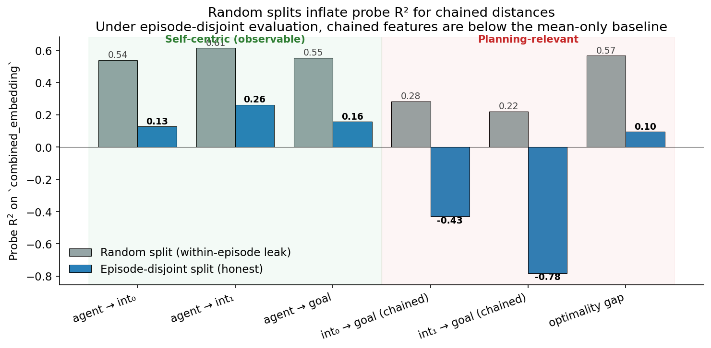
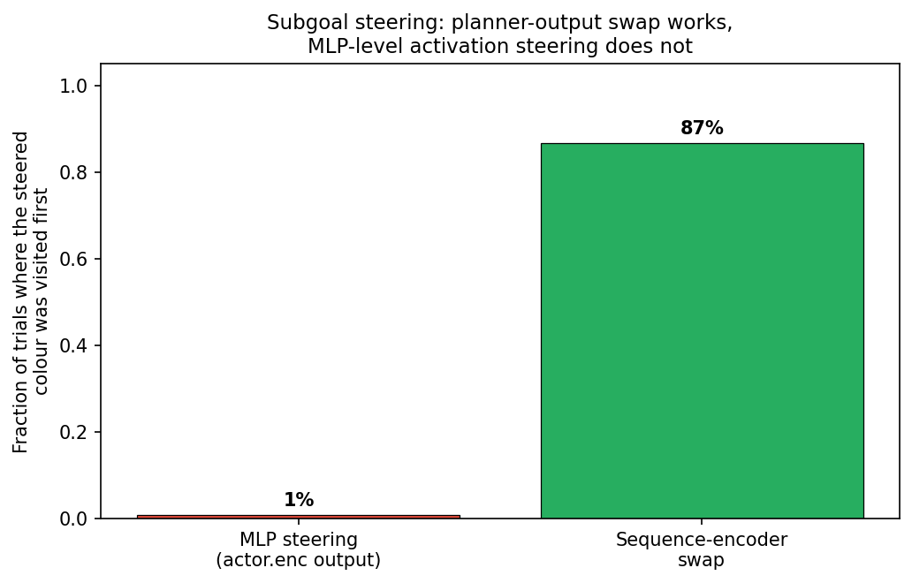
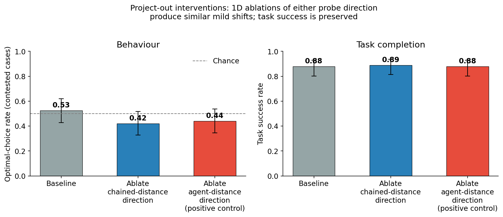
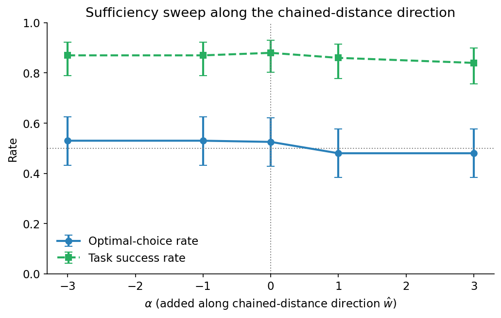

# Does DeepLTL Plan?

[DeepLTL](https://openreview.net/forum?id=9pW2J49flQ) (Jackermeier & Abate, ICLR 2025) is a goal-conditioned reinforcement-learning agent that translates Linear Temporal Logic specifications into sub-goals and satisfies them at ~95% success on the paper's benchmark. Its Figure 1 makes a stronger claim than success: faced with `F blue THEN F green` and two candidate blue zones, the agent picks the *farther* blue zone — because doing so leaves a shorter onward path to green. If the agent makes that choice systematically, it is doing multi-step planning.

This post tests whether it does. The short answer is no: across behavioural, representational, and causal-intervention experiments, the agent looks like a reactive heuristic policy that benefits from continuous control and lidar-based avoidance. The longer answer is below.

This is joint work with Jonathan Richens (Google DeepMind); the framing draws on [*General Agents Need World Models*](https://arxiv.org/abs/2506.01622). Mathias Jackermeier was generous with his time, and several of the training interventions described here were his suggestions.

**Summary.**

- On a custom environment where the myopic and optimal first sub-goal disagree by construction, the agent picks optimally **~50%** of the time, indistinguishable from chance.
- An apparent above-chance signal (~58%) is fully explained by a **forward-motion bias** (74%, p < 0.0001). With orientation controlled, the residual disappears.
- The chained-distance feature — what a planning agent would compute — is not linearly encoded under proper held-out evaluation (probe R² is *negative* on episode-disjoint splits). Only self-centric features generalise (R² ≈ 0.13 – 0.26).
- Activation-level interventions are consistent: 1D ablation of either probe direction (chained or agent) shifts the optimal-choice rate by ≈ 10 percentage points toward more myopic behaviour, with task success preserved at ≈ 88%. Sufficiency sweeps along the chained-distance direction are flat. The policy is locally robust to single-direction perturbations.
- Training interventions designed to induce planning — auxiliary chained-distance loss, transition loss, lower discount, two-step-heavy curriculum — do not move the optimality rate. The best stable variant achieves 85% task success at 52% optimal (p = 0.76).

The evidence converges on a heuristic account: forward motion, then closest relevant zone, then reactive obstacle avoidance — a stack that produces 95% completion on a completion-scored benchmark without any internal world model.

---

## 1. The setup

DeepLTL has three modules. An **LTL encoder** compiles the formula into a deterministic-Büchi automaton, summarised by a small GRU over its states. An **environment encoder** is an MLP over lidar observations. A **policy head** concatenates the two and outputs continuous actions for a point robot in the Zone environment — a flat arena of coloured circular zones.

The cleanest test of planning is `F blue THEN F green` with *two* candidate blue zones. A planner picks the blue zone that leaves less distance to green. A reactive "closest zone" policy picks whichever blue is closer right now. The paper's Figure 1 shows the former.

I built `PointLtl2-v0.optvar`, a custom environment in which this divergence is enforced at every reset: the closer blue zone is always the *worse* one for total path length.

If the agent plans, it should pick the optimal (farther) blue consistently. If it doesn't, it should pick the myopic (closer) blue consistently. Either pattern would be informative.

---

## 2. Behaviour: at chance

Across 100 contested layouts on `optvar`, with `fresh_baseline` (a faithful re-train of the paper setup):

| | Rate |
|---|---|
| Optimal-choice rate | **50%** |
| Myopic-choice rate | 50% |
| Task success rate | 93% |

That is high task success at chance-level sub-goal selection. The agent reaches green almost always; its choice between candidate blues is essentially a coin flip.

A reasonable concern is that "optimal" might be defined wrong. Geometric distance is one definition; *empirical difficulty* — the success rate when each candidate is forced — is another. Under the empirical definition, the agent picks the easier candidate 68% of the time, with a confidence interval that excludes 50%. The next two checks show why this is illusory.

### 2a. Equidistant control

If the agent considers full path length, equating the *agent-to-blue* distances should not affect performance. In `PointLtl2-v0.opteq` the two blues are placed at the same distance from the agent (tolerance 0.05).

| | fresh_baseline |
|---|---|
| Optimal-choice rate | **54%** |
| 95% CI | [40%, 70%] |

The 68% empirical-difficulty signal therefore was not driven by full-path reasoning. It was driven by something correlated with full-path difficulty in the optvar layouts but absent in opteq. The simplest such correlate is "closer to the agent".

### 2b. Orientation control

A separate confound was visible in the data. fresh_baseline preferred the `x < 0` zone 66% of the time; a sibling auxiliary-loss model preferred `x > 0` 61% of the time. Two models with opposite spatial biases is itself weak evidence against planning, but it does not identify the rule.

Logging the agent's initial heading made the rule visible:

- Forward-motion preference: **74%** (p < 0.0001).
- When only one candidate lies in the forward half-plane: **80%** chosen.

I repeated the optimality test with orientation controlled: at each reset the agent was rotated to face the midpoint between the two blues, so neither was more "forward":

| Model | Optimal | 95% CI | p |
|---|---|---|---|
| fresh_baseline | **58%** | [48%, 68%] | 0.125 |
| opt_d099_mixed | 52% | [42%, 62%] | 0.764 |

The CI contains 50%. The spatial imbalance vanishes exactly, because the imbalance was never about left/right — it was about forward. With both forward-motion and closest-zone cues neutralised, the agent's choice is statistically indistinguishable from random.

---

## 3. Representations: what the agent encodes

### 3.1 Information flow through the actor stack

The actor is a 3-layer MLP with ReLU activations: a 96-d combined embedding (`IN`) is mapped through three 64-d hidden layers (`H1`, `H2`, `H3`) before a final linear head produces the policy mean (`OUT`). I trained linear probes (Ridge for regression, logistic for classification) at each depth on a representative set of targets. Splits are episode-disjoint: 64 of 80 layouts in training, 16 held out.

A few things stand out.

- **Sensors fade.** `agent_speed` is well-encoded at the input (R² ≈ 0.77) and fades to ≈ 0 by the output. The MLP discards raw sensor information as it computes its action.
- **Policy-aligned features rise.** Whether the agent is about to turn left or right is decodable at 66% accuracy at `IN`, 100% at `OUT`. The 8-class action-direction lift is similarly steep (59% → 96%).
- **The goal-colour identifier is preserved with near-perfect accuracy through `H3` (≥ 98%), then drops sharply at `OUT` (38%).** The actor carries the goal pointer all the way to the last hidden layer and discards it once the action is committed.
- **Self-centric *bearing* to the goal zone is at chance (≈ 10% on 8 classes) at every layer.** This is in spite of the agent's eventual *policy angle* being decoded near-perfectly. The agent is not computing its action direction by reading off a clean goal-bearing feature; whatever drives the action direction is computed otherwise — perhaps a obstacle-modulated heading, or a learned mapping that is non-linear in this representation.
- **Geometry features are not encoded.** Absolute agent position and one-step Δx have negative R² across every layer. The actor does not store a metric map.

The shape of the gradient — environment-relevant features at the top, action-relevant features at the bottom, no metric map at any depth — is the picture of an *egocentric, reactive controller* whose representations are progressively shaped toward action.

### 3.2 The LTL planner's output is a stable state machine

The DeepLTL architecture has a small GRU on top of the deterministic-Büchi automaton's state sequence. At every step the network re-encodes the current LTL plan from scratch and produces a 32-d "LTL embedding". On a 2-step task `F a THEN F b`, this embedding is *constant* during pursuit of `a`, then jumps when the LDBA transitions to pursuing `b`.

How predictable is its evolution from the combined embedding `h_t` alone?

Within a sub-goal pursuit, Δltl is exactly zero, so the linear probe's R² is trivially 1. At the goal switch, Δltl jumps to a specific colour-dependent vector, and a linear function of `h_t` predicts the jump with R² ≈ 0.97 (action gives no extra information). The picture is a near-linear state machine that retargets at switches, very much in line with how the architecture is set up by construction.

### 3.3 The chained-distance feature is not actually encoded

The actor encodes its own goal pointer, lidar readings, and a developing action. Does it also encode the *path-level* feature a planner would need — the chained distance from a candidate intermediate zone to the goal zone?

A first pass with random train/test splits across states gave a familiar result: self-centric features at R² ≈ 0.55, chained features at R² ≈ 0.22 — present but weak, consistent with weak planning. But that random split has a pitfall. Zone positions are constant within an episode, so any feature defined by the layout (`d_int_to_goal`, `total_via_int`, `optimality_gap`) is constant across all of an episode's states. A random split lets the probe see *some* states from a layout in training and predict *others* from the same layout at test time — recognising the episode rather than computing the feature.

Splitting by episode breaks this leak. With 64 of 80 layouts in training and 16 held out, the probe must generalise to layouts it has never seen.

Self-centric features still survive, at lower R² (≈ 0.13 – 0.26): the probe finds something real and generalisable. Chained features do not — both `int₀ → goal` and `int₁ → goal` have *negative* R², worse than always predicting the training mean. The "0.08 – 0.18" chained-distance R² that some earlier analyses reported is essentially the within-episode recognition signal; the underlying feature is not linearly decodable from a held-out layout's hidden states.

The value function shows the same pattern. Holding the first sub-goal fixed and varying the second:

- *Same first target, different second targets?* V(state, [A, easy]) − V(state, [A, hard]) = **0.003**. Within noise.

---

## 4. Causal: what the agent uses

Linear probes establish presence, not use. The actor-stack analysis showed that the goal colour is decodable at near-perfect accuracy through `H3`. Does that mean the goal is *steerable* by perturbing those activations?

### 4.1 Subgoal steering: the goal lives at the planner output, not in the actor MLP

I trained a logistic-regression classifier on `H3` to predict the current goal colour (the same target that probed at 100% in the previous section). The classifier achieves 100% in-sample accuracy. From its weight matrix I extracted a *steering vector* `w_target − w_source` for every (source → target) colour pair, and ran two interventions on a `F source` task:

- **MLP steering**: at every forward pass, add `α · ŵ` to the output of `actor.enc` (the H3 layer). α = 20.
- **Sequence-encoder swap**: replace the LTL embedding with the embedding the network produces for `F target`.

Both interventions target the same outcome (visit the *target* colour first). They differ in *where* the perturbation enters the network. Across 120 trials each:

The goal colour is decodable in the actor MLP with perfect accuracy, but adding even a large perturbation along the probe direction does almost nothing — most of those trials simply fail to reach any zone, with 1 in 120 actually switching to the steered colour. Replacing the planner's output redirects the agent in 87% of trials. The actionable copy of the goal lives at the *bottleneck* between planner and actor, not in the distributed redundant copy that the probe reads from.

This is a clean example of probes establishing presence, not use.

### 4.2 Project-out and sufficiency on chained distance

A second causal test, focused not on the goal pointer but on the chained-distance feature explored in §3.3. I ran two activation-level interventions on the combined embedding (96 dims).

**Project-out.** For each probe with direction `w` (unit-normed), at every forward pass replace `h ← h − (w·h) w`. This removes precisely the linear component the probe reads.

**Sufficiency.** Add `α · ŵ` for several values of α and observe behavioural drift.

The two probes I have are:

- `d_agent_to_int` — self-centric, episode-disjoint R² ≈ 0.55. *Positive control.*
- `d_int_to_goal` — chained-distance, episode-disjoint R² < 0. The probe direction exists but does not track the feature on held-out layouts.

Each condition runs 100 contested `optvar` layouts with identical seeds for a paired comparison.

| Condition | Optimal-choice rate | Task success |
|---|---|---|
| Baseline (no intervention) | **53%** | 88% |
| Ablate chained-distance direction | 42% | 89% |
| Ablate agent-distance direction *(positive control)* | 44% | 88% |

The pattern is more nuanced than I expected. Both ablations produce a similar small shift toward more myopic behaviour (≈ 10 percentage points). Task success is preserved across all conditions. The agent-distance probe was meant to be a positive control where the ablation would clearly degrade behaviour — instead, both ablations look alike. The sufficiency sweep is essentially flat across α ∈ {−3, −1, 0, +1, +3}:

Three things to take away:

1. **The policy is robust to 1D perturbations.** Removing any single probe direction in a 96-dim embedding leaves the bulk of the representation intact. Whatever the policy reads, it does not read it through a single direction.

2. **No direction-specific evidence for chained-distance use.** The chained-distance ablation looks like the agent-distance ablation, and the sufficiency sweep is flat. There is no positive evidence that the chained-distance probe direction is causally important for behaviour. This is consistent with the probing finding (the direction does not even encode the feature on held-out layouts) but does not rule out the feature being computed elsewhere or non-linearly.

3. **A stronger intervention would be informative.** Multi-dimensional subspace projection or larger sufficiency steps could push the network harder; with a 96-dim embedding, removing a single 1D component evidently does not. I leave that for a follow-up.

The methodological caveat is unchanged: high probe R² is not, by itself, evidence that a feature is driving behaviour, and even a clean activation-level intervention requires care in scope.

### 4.3 Goal-switch interventions: the agent re-locks from observations

A separate causal test, focused on what happens at the moment a 2-step task transitions from `F a` to `F b`. If the GRU hidden state at the switch is doing important work — bridging from "pursued a" to "pursue b" — then perturbing the LTL embedding *exactly* at the switch step should hurt success. I ran four conditions on `F a THEN F b` tasks (80 episodes each):

| Condition | Task success |
|---|---|
| baseline | 99% |
| zero ltl_emb at switch, 1 step | 96% |
| zero ltl_emb at switch, 3 steps | 93% |
| random ltl_emb at switch, 1 step | 99% |

Task success is preserved across all conditions. Even three consecutive steps of zeroed-out LTL embedding only drops success by 6 percentage points. The agent re-locks on the new sub-goal from observations and the planner's *next* timestep output — the embedding at the precise switch step is not load-bearing.

This complements the steering result: the planner output is the actionable goal pointer, but a one-step interruption of that pointer is recoverable from the next step's planner output plus current observations. There is no "memory" stored between steps that has to be intact at the switch.

---

## 5. Training interventions don't help

Could planning be induced from the training side? Mathias suggested the relevant hypotheses: the default discount of 0.998 makes return differences between optimal and suboptimal sequences vanishingly small, and a curriculum that begins with one-step reach tasks conditions the agent on a "closest zone" prior before sequences for which it is suboptimal arrive.

I ran the corresponding sweep:

| Variant | Discount | Curriculum | Task success | Optimal | p |
|---|---|---|---|---|---|
| `fresh_baseline` | 0.998 | 1-step start | 91% | 58% | 0.125 |
| `extended_baseline` | 0.998 | 1-step (30M steps) | 95% | 59% | 0.093 |
| `twostep_lowdiscount` | 0.95 | 2-step only | 38% | unstable | — |
| `opt_d095_mixed` | 0.95 | 75% 2-step + 25% 1-step | 64% | unstable | — |
| `opt_d099_mixed` | **0.99** | mixed | **85%** | **52%** | **0.764** |
| aux loss 0.2 | 0.998 | baseline | 90% | ~50% | — |
| transition loss 0.1 | 0.998 | baseline | 89% | ~50% | — |
| combined aux + transition | 0.998 | baseline | 75% | ~50% | — |

The pure two-step run at γ = 0.95 collapses. Of the curriculum/discount variants, only `opt_d099_mixed` reaches task success close to baseline (85% vs. paper's 91 – 95%), and its optimality rate is 52%, p = 0.76.

The most informative observation in the sweep is the auxiliary-loss column. Chained-distance probe R² (random-split, used here for comparability with earlier analyses; the corresponding episode-disjoint R² is below zero throughout) rises from 0.31 to 0.41 — a real increase in probe-decodable content. Optimal-choice rate stays at ~50%. The policy has acquired more of the information that planning would require, and does not use it.

Together with the project-out result, this gives the same answer from two directions: training the network to make the chained-distance feature more readable does not change behaviour, and removing the readable component from activations does not change behaviour either. Representation and policy have separated.

---

## 6. A heuristic account

The behaviour I observe is consistent with a small stack of reactive rules, applied roughly in this order:

1. Move forward, with probability ≈ 0.74 along the initial heading.
2. Otherwise, move toward the closest relevant zone.
3. Avoid obstacles via lidar; the binary "blocked" feature is well-encoded (~95%).
4. When none of (1) – (3) discriminates between candidates, choose approximately at random.

This stack accounts for 95% success on a benchmark that scores completion, and it accounts for chance-level sub-goal selection on a benchmark that scores planning specifically. The two are not contradictory — completion is robust to bad first commitments, given enough lidar and continuous control to recover.

The agent's behaviour, viewed colour-by-colour, is well-summarised by a 4×4 stochastic matrix `P(reach next | reached current)`. I estimated this matrix from 12 episodes per pair on `F a THEN F b` tasks, then used it to predict success on length-2 and length-3 chains.

The prediction matches the empirical multi-step success within MAE ≈ 0.02 – 0.03. The agent's behaviour can be summarised at the colour level by an external Markov chain — a *behavioural* world model. Critically, this does not imply that the agent has internalised this matrix as a mental model. The fit just says the macro structure is recoverable from rollouts. Combined with the absence of a metric map in the activations (§3.1), the natural reading is: the network executes a near-Markov colour policy, and any "world model" lives in the analyst's notebook, not in the network.

---

## 7. Scope

The paper's task-success numbers reproduce. As an additional sanity check, the agent's success rate on single-colour tasks (`F c` for c ∈ {blue, green, yellow, magenta}) averages 98% versus 0% for a uniform-random policy on the same layouts, giving a [Maximum Entropy Goal-directedness](https://arxiv.org/abs/2310.07229) score of GD ≈ 3.2 averaged across goals. Whatever the agent is doing internally, it is reliably goal-conditioned at the behavioural level.

The narrower claim this post pushes back on is the mechanistic one: that sub-goal selection is driven by reasoning about onward paths. Mathias concurs that the optimality rate is approximately 50%; remaining disagreement, if any, concerns how surprising this should be considered.

A few caveats:

- This is one architecture trained one way. Other architectures — explicit successor features, MuZero-style world models, transformers over automaton states — may produce different results.
- Sample sizes are moderate (N = 80 – 100 per behavioural cell). Borderline results would benefit from larger N.
- The behavioural evidence concerns one task family, `F A THEN F B` and its safety/equidistant variants. Tasks with richer temporal structure may interact with a heuristic policy differently.
- Confounds have recurred. "Spatial bias" turned out to be orientation bias; "weak chained-distance encoding" turned out to be within-episode leak. There may be further confounds I have not yet identified.

The broader point worth stating plainly: high task success is not, by itself, evidence of planning, even on tasks that would in principle require it. A sufficiently rich reactive policy, combined with continuous control, lidar-based avoidance, and a benchmark that scores completion rather than optimality, can reach 95% success without instantiating anything that resembles a world model.

---

## Code and references

- This work: [`does-deep-ltl-plan`](https://github.com/benjibrcz/does-deep-ltl-plan). All scripts under `interpretability/`.
- Jackermeier & Abate, [*DeepLTL*](https://openreview.net/forum?id=9pW2J49flQ), ICLR 2025.
- Richens et al., [*General Agents Need World Models*](https://arxiv.org/abs/2506.01622), 2025.

To reproduce the central finding: load `fresh_baseline`, run `interpretability/behavioural/controlled_orientation_test.py` for N = 100 episodes of `F blue THEN F green` on `PointLtl2-v0.opteq`. Expected: 50% ± a few percent, with a CI that comfortably contains chance. A substantial deviation from that figure would be informative.
